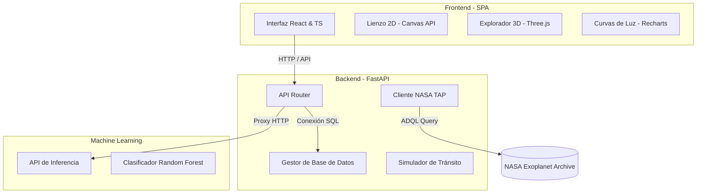

# Documentación Técnica Exhaustiva — Proyecto Astralis

Este documento contiene la especificación técnica, la arquitectura del sistema, el diseño de componentes y la documentación detallada del código para el proyecto **Astralis**, una plataforma de visualización astronómica y análisis de exoplanetas.

---

## 🏛️ Arquitectura y Estructura del Sistema

Astralis está estructurado bajo una arquitectura de microservicios distribuidos y desacoplados. La comunicación se realiza mediante HTTP REST y transferencias asíncronas de datos.



### Componentes de la Solución
1. **Frontend (`frontend/`)**: Aplicación de página única (SPA) interactiva estructurada con React, TypeScript y Vite. Gestiona visualizaciones matemáticas en Canvas y Three.js.
2. **Backend (`backend/`)**: API REST asíncrona construida en FastAPI. Procesa solicitudes de datos celestes, genera curvas de luz dinámicas y sirve de proxy hacia el microservicio de Machine Learning.
3. **Servicio ML (`ml_service/`)**: Microservicio FastAPI dedicado a clasificar candidatos de exoplanetas usando un modelo supervisado Random Forest y a re-entrenar el clasificador de forma asíncrona.
4. **Infraestructura (`k8s/`, `docker-compose.yml`)**: Orquestación y empaquetado del ecosistema completo.

---

## 1. 💻 Frontend & Visualizaciones

La interfaz visual está optimizada para el renderizado eficiente de simulaciones en el cliente mediante Canvas y WebGL.

### Componentes y Vistas Principales

#### A. Simulador Orbital 2D (Canvas API)
El simulador orbital modela el movimiento de los planetas del sistema solar interior y exterior basándose en la Tercera Ley de Kepler. La velocidad orbital angular de cada planeta se ajusta dinámicamente según su distancia media al Sol (en Unidades Astronómicas):

```typescript
// Archivo: frontend/src/components/orbital/OrbitalCanvas.tsx
const BASE_SPEED = 0.008;

const PLANETS: PlanetData[] = [
  {
    id: "mercury",
    name: "Mercurio",
    color: "#b5b5b5",
    glowColor: "#d4d4d4",
    radius: 4,
    orbitRadius: 80,
    distanceAU: 0.39,
    orbitalPeriodDays: 88,
    diameterKm: 4879,
    moons: 0,
    rings: false,
    speed: (BASE_SPEED / Math.pow(0.39, 1.5)) * 0.39, // Velocidad Kepleriana ajustada
    angle: Math.random() * Math.PI * 2,
    fact: "El planeta más pequeño y más cercano al Sol.",
  },
  {
    id: "earth",
    name: "Tierra",
    color: "#4B9CD3",
    glowColor: "#87ceeb",
    radius: 7,
    orbitRadius: 185,
    distanceAU: 1.0,
    orbitalPeriodDays: 365,
    diameterKm: 12742,
    moons: 1,
    rings: false,
    speed: BASE_SPEED,
    angle: Math.random() * Math.PI * 2,
    fact: "Único planeta conocido con vida.",
  }
];
```

El motor de animación utiliza `requestAnimationFrame` para recalcular posiciones y dibujar las trayectorias de manera continua:

```typescript
// Archivo: frontend/src/components/orbital/OrbitalCanvas.tsx (bucle de dibujo)
planetsRef.current.forEach((planet) => {
  if (!pausedRef.current) {
    planet.angle += planet.speed * speedRef.current;
  }
  const x = cx + Math.cos(planet.angle) * planet.orbitRadius * zoom;
  const y = cy + Math.sin(planet.angle) * planet.orbitRadius * zoom;
  positionsRef.current[planet.id] = { x, y };

  const trail = trailsRef.current[planet.id];
  if (!pausedRef.current) {
    trail.push([x, y]);
    if (trail.length > TRAIL_LENGTH) trail.shift();
  }
  drawTrail(planet, trail, cx, cy, zoom);
  drawPlanet(planet, x, y, cx, cy, zoom);
});
```

#### B. Exploración 3D de Planetas (Three.js)
El componente `PlanetViewer` implementa WebGL para renderizar mallas esféricas texturizadas interactivas. Cuenta con rotación orbital programada y atenuación de inercia tras arrastre manual:

```typescript
// Archivo: frontend/src/components/orbital/PlanetViewer.tsx
const scene = new THREE.Scene();
const camera = new THREE.PerspectiveCamera(45, W / H, 0.1, 1000);
camera.position.z = 3;

const renderer = new THREE.WebGLRenderer({ antialias: true, alpha: true });
renderer.setSize(W, H);
mount.appendChild(renderer.domElement);

const geometry = new THREE.SphereGeometry(1, 64, 64);
const textureUrl = TEXTURES[planet.id];
const material = textureUrl
  ? new THREE.MeshPhongMaterial({
      map: new THREE.TextureLoader().load(textureUrl),
      shininess: 30,
    })
  : new THREE.MeshPhongMaterial({
      color: new THREE.Color(planet.color),
      shininess: 30,
    });

const mesh = new THREE.Mesh(geometry, material);
scene.add(mesh);
```

Para Saturno se añade una geometría de anillos específicos:

```typescript
if (planet.rings) {
  const ringGeo = new THREE.RingGeometry(1.4, 2.2, 64);
  const ringMat = new THREE.MeshBasicMaterial({
    color: 0xe8d5a3,
    side: THREE.DoubleSide,
    transparent: true,
    opacity: 0.6,
  });
  const ring = new THREE.Mesh(ringGeo, ringMat);
  ring.rotation.x = Math.PI / 3;
  scene.add(ring);
}
```

---

## 2. ⚙️ Backend & Lógica de Negocio

El backend está desarrollado sobre FastAPI, proporcionando endpoints para el catálogo, simulación orbital y proxy de inferencia.

### Componentes Clave

#### A. Integración con el NASA Exoplanet Archive (ADQL/TAP)
El backend cuenta con un cliente que realiza consultas asíncronas utilizando sentencias **ADQL** hacia la base de datos central de la NASA. El resultado se procesa con Pandas y se guarda localmente en caché:

```python
# Archivo: backend/app/services/nasa.py
def _load_df() -> pd.DataFrame:
    global _df_cache
    if _df_cache is not None:
        return _df_cache

    if not os.path.exists(CSV_PATH):
        try:
            import httpx
            os.makedirs(os.path.dirname(CSV_PATH), exist_ok=True)
            # Consulta asíncrona TAP ADQL
            url = (
                "https://exoplanetarchive.ipac.caltech.edu/TAP/sync?"
                "query=select+kepid,kepler_name,kepoi_name,koi_period,koi_prad,koi_teq,koi_disposition,koi_score+from+cumulative"
                "&format=csv"
            )
            response = httpx.get(url, timeout=30.0)
            response.raise_for_status()
            with open(CSV_PATH, "wb") as f:
                f.write(response.content)
        except Exception as e:
            print(f"Error al descargar exoplanetas de la API NASA: {e}")
            if not os.path.exists(CSV_PATH):
                return _mock_df()
```

#### B. Algoritmo de Simulación Fotométrica de Curvas de Luz
La curva de luz se genera en el endpoint `/api/exoplanets/{exoplanet_id}/lightcurve` aplicando un modelo geométrico de atenuación proporcional a la relación de áreas estelares e inyectando ruido gaussiano para simular la dispersión real de sensores espaciales:

```python
# Archivo: backend/app/routers/exoplanets.py
def _transit_depth(planet_radius: float) -> float:
    ratio = planet_radius * 0.009167  # Radios terrestres a radios solares
    return min(ratio * ratio, 0.05)

def _transit_shape(t: float, duration: float, depth: float) -> float:
    half_d = duration / 2
    ingress = duration * 0.15 # 15% del tiempo en tránsito se considera ingreso/egreso
    if abs(t) > half_d:
        return 1.0
    if abs(t) > half_d - ingress:
        phase = (half_d - abs(t)) / ingress
        return 1.0 - depth * math.sin((phase * math.pi) / 2) ** 2
    return 1.0 - depth

def _generate_light_curve(planet_radius: float, orbital_period: float) -> list[dict]:
    depth = _transit_depth(planet_radius)
    duration = min(orbital_period * 0.01, 8)
    noise_level = 0.0008 + random.random() * 0.0004
    total_time = duration * 4
    steps = 200
    points = []
    for i in range(steps + 1):
        t = -total_time / 2 + (i / steps) * total_time
        flux = _transit_shape(t, duration, depth)
        noise = (random.random() - 0.5) * 2 * noise_level # Ruido instrumental simulado
        points.append({
            "time": round(t, 3),
            "flux": round(flux, 6),
            "fluxNoise": round(flux + noise, 6),
        })
    return points
```

#### C. Tolerancia de Inicialización en Persistencia
La base de datos se adapta al entorno de ejecución. Si el controlador de producción PostgreSQL no está presente o falla la conexión, conmuta dinámicamente a una persistencia en memoria local con SQLite para evitar fallas del microservicio:

```python
# Archivo: backend/app/core/database.py
try:
    if "pytest" in sys.modules or not psycopg2_installed:
        DATABASE_URL = "sqlite:///./test.db"
        engine = create_engine(DATABASE_URL, connect_args={"check_same_thread": False})
    else:
        engine = create_engine(DATABASE_URL)
except Exception:
    DATABASE_URL = "sqlite:///./test.db"
    engine = create_engine(DATABASE_URL)
```

---

## 3. 🧠 Machine Learning & Análisis

El procesamiento analítico clasifica a los candidatos a exoplanetas en tres posibles estados (`CONFIRMED`, `CANDIDATE`, `FALSE_POSITIVE`).

### Modelo RandomForest y Lógica de Inferencia

#### A. Imputación Dinámica de Atributos Faltantes
El clasificador requiere 12 variables físicas del dataset Kepler. En solicitudes donde no estén completas, el microservicio ML realiza una imputación en caliente asignando la mediana calculada del set de entrenamiento:

```python
# Archivo: ml_service/app/model.py
def _features_to_array(self, feat: ExoplanetFeatures) -> tuple[np.ndarray, int]:
    available_features = self.meta.get("features", ML_FEATURES)
    row = []
    used = 0
    for f in available_features:
        val = getattr(feat, f, None)
        if val is None:
            row.append(self.medians.get(f, 0.0)) # Imputación por mediana pre-calculada
        else:
            row.append(float(val))
            used += 1
    return np.array([row]), used
```

#### B. Entrenamiento en Segundo Plano No Bloqueante
El re-entrenamiento del clasificador se ejecuta asíncronamente en segundo plano. Esto asegura que la API de predicciones siga activa respondiendo solicitudes con la versión previa del modelo hasta que el nuevo modelo esté guardado y cargado en memoria:

```python
# Archivo: ml_service/app/main.py
@app.post("/model/retrain", response_model=RetrainResponse, tags=["model"])
async def retrain(background_tasks: BackgroundTasks):
    background_tasks.add_task(ml_model.retrain)
    return RetrainResponse(
        status="retraining_started",
        message="Re-entrenamiento iniciado en background. Consulta /health para ver cuando termina.",
        current_version=ml_model.version,
    )
```

---

## 4. ⚙️ DevOps & Infraestructura

El despliegue y empaquetado del sistema está diseñado bajo estándares de reproducibilidad utilizando entornos contenerizados en Docker y Kubernetes.

### Docker Compose
Coordinación de los microservicios mediante variables de red interna y secuencias de inicio basadas en pruebas de salud del motor relacional PostgreSQL:

```yaml
# Archivo: docker-compose.yml
version: '3.8'

services:
  db:
    image: postgres:15-alpine
    restart: always
    environment:
      POSTGRES_USER: user
      POSTGRES_PASSWORD: password
      POSTGRES_DB: astralis
    ports:
      - "5432:5432"
    volumes:
      - postgres_data:/var/lib/postgresql/data
    healthcheck:
      test: ["CMD-SHELL", "pg_isready -U user -d astralis"]
      interval: 5s
      timeout: 5s
      retries: 5

  backend:
    build:
      context: ./backend
      dockerfile: Dockerfile
    ports:
      - "8000:8000"
    environment:
      - DATABASE_URL=postgresql://user:password@db:5432/astralis
      - ML_SERVICE_URL=http://ml:8001
    depends_on:
      db:
        condition: service_healthy
      ml:
        condition: service_started
```

### Orquestación en Kubernetes
El despliegue en clúster utiliza manifiestos de red interna (`Service`) para resolver dinámicamente nombres de host sin acoplamientos rígidos de IP. El servicio del backend de FastAPI se define como `backend` coincidiendo con la configuración del reenvío de tráfico (proxy de Nginx en la imagen Docker del frontend):

```yaml
# Archivo: k8s/backend.yaml
apiVersion: v1
kind: Service
metadata:
  name: backend  # Coincide con proxy_pass http://backend:8000/api/ en el conf de Nginx
spec:
  ports:
    - port: 8000
  selector:
    app: astralis-backend
```

---

## 5. 📹 Grabaciones de Funcionamiento y Despliegue

Se realizaron capturas demostrativas del funcionamiento general de la plataforma y del proceso de despliegue automatizado:

### A. Funcionamiento General de la Aplicación
Demostración interactiva de la interfaz de usuario, incluyendo el inicio de sesión con JWT, el simulador orbital 2D (con controles de escala y velocidad), el visualizador 3D de planetas desarrollado en Three.js, el catálogo paginado y filtrado de exoplanetas con sus curvas de tránsito (Recharts), y el rastreador en tiempo real de la ISS:


### B. Despliegue del Sistema (Script deploy.ps1)
Muestra del proceso de orquestación y despliegue automatizado tanto en entornos locales utilizando contenedores de Docker Compose como en clústeres de orquestación de Kubernetes mediante el script interactivo en PowerShell:


