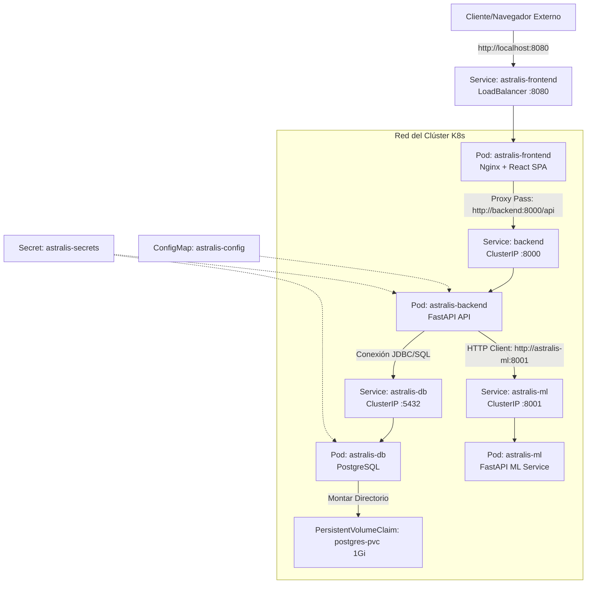

# Arquitectura y Guía de Despliegue de Kubernetes — Astralis

Este documento detalla la arquitectura de orquestación implementada para **Astralis** utilizando **Kubernetes (K8s)**. Explica el diseño de los recursos, la solución de red para la comunicación inter-servicio, y el proceso paso a paso para desplegar y verificar el sistema en clústeres locales como Docker Desktop Kubernetes o Minikube.

---

## 1. Diseño Arquitectónico

La infraestructura de Astralis se compone de cuatro microservicios principales desacoplados, ejecutándose en Pods aislados dentro de la red del clúster:

1. **Base de Datos (`astralis-db`):** Servidor PostgreSQL que almacena usuarios y registros locales persistidos.
2. **Backend API (`astralis-backend`):** Servicio FastAPI que expone endpoints REST, realiza cálculos astronómicos, interactúa con la BD y consume predicciones del microservicio de Machine Learning.
3. **Frontend (`astralis-frontend`):** Servidor Nginx que aloja la SPA en React y actúa como proxy inverso para enrutar las peticiones `/api/*` al backend.
4. **Microservicio de Machine Learning (`astralis-ml`):** Servicio FastAPI independiente que carga un modelo Random Forest preentrenado para clasificar exoplanetas candidatos Kepler.

### Diagrama de Flujo y Topología



---

## 2. Descripción de los Manifiestos (`k8s/`)

Los manifiestos declarativos se organizan en la carpeta `k8s/` y constan de las siguientes especificaciones:

### A. Configuración y Seguridad
*   **`secrets.yaml`:** 
    *   Almacena credenciales críticas del sistema cifradas bajo el esquema estándar Base64 de Kubernetes.
    *   Contiene variables como `postgres-user`, `postgres-password`, `postgres-db`, `secret-key` (para tokens JWT) y la cadena completa `database-url`.
*   **`configmap.yaml`:**
    *   Define configuraciones globales no sensibles del entorno.
    *   Especifica variables de entorno como el estado del sistema (`ENV=development`), la URL del frontend expuesta (`FRONTEND_URL=http://localhost:8080`) y la URL interna del microservicio de Machine Learning (`ML_SERVICE_URL=http://astralis-ml:8001`).
    *   El backend utiliza esta URL interna para enrutar las peticiones de predicción hacia el pod de ML.

### B. Capa de Datos (`db.yaml`)
*   **`PersistentVolumeClaim` (PVC):**
    *   Solicita un almacenamiento persistente de `1Gi` con acceso `ReadWriteOnce`. Esto garantiza que los datos de PostgreSQL no se borren cuando el pod de la base de datos se reinicie, se reubique o se actualice.
*   **`Deployment`:**
    *   Despliega el motor `postgres:15-alpine`.
    *   Inyecta el usuario, contraseña y base de datos inicial mapeados directamente desde `secrets.yaml`.
    *   Monta el volumen en `/var/lib/postgresql/data`.
*   **`Service`:**
    *   Expone a Postgres de manera interna a través del puerto `5432` con el nombre de host DNS `astralis-db`.

### C. Capa Lógica (`backend.yaml`)
*   **`Deployment`:**
    *   Inicializa la imagen local compilada `astralis-backend:latest`.
    *   Define variables de entorno necesarias inyectadas desde los recursos `Secret` y `ConfigMap` (incluyendo `ML_SERVICE_URL` del ConfigMap para conectarse al servicio de Machine Learning).
    *   Configura el puerto interno del contenedor en el `8000`.
*   **`Service`:**
    *   Crea un servicio interno de tipo `ClusterIP` expuesto en el puerto `8000`.
    *   **Importante:** Se le asignó el nombre `backend` para alinearse con la configuración de resolución DNS de Nginx.

### D. Capa de Machine Learning (`ml.yaml`)
*   **`Deployment`:**
    *   Inicializa la imagen local compilada `astralis-ml:latest` que contiene el servicio FastAPI y el modelo Random Forest entrenado.
    *   Configura el puerto interno del contenedor de ML en el `8001`.
*   **`Service`:**
    *   Crea un servicio interno de tipo `ClusterIP` expuesto en el puerto `8001` con el nombre DNS `astralis-ml`.
    *   Esto permite al backend resolver la dirección `http://astralis-ml:8001` internamente mediante CoreDNS de Kubernetes.

### E. Capa de Presentación (`frontend.yaml`)
*   **`Deployment`:**
    *   Crea un Pod ejecutando la imagen `astralis-frontend:latest`.
    *   El contenedor corre un servidor web Nginx escuchando en el puerto `80` (dentro del contenedor).
*   **`Service`:**
    *   Expone el frontend hacia fuera del clúster mediante un tipo de servicio `LoadBalancer`.
    *   Mapea el puerto externo `8080` de la máquina anfitriona (localhost) hacia el puerto interno `80` del contenedor.

---

## 3. Resolución de Errores de Red Críticos: El Caso del Host Inalcanzable

Durante el despliegue inicial, el Pod del frontend entraba en bucles continuos de reinicio (estado `CrashLoopBackOff`). Los logs del pod arrojaban la siguiente falla:

```text
2026/06/12 01:47:10 [emerg] 1#1: host not found in upstream "backend" in /etc/nginx/conf.d/default.conf:10
nginx: [emerg] host not found in upstream "backend" in /etc/nginx/conf.d/default.conf:10
```

### Origen del Problema
En el archivo `nginx.conf` del frontend, se configuró un proxy inverso para pasar todas las peticiones con prefijo `/api/` al backend:
```nginx
location /api/ {
    proxy_pass http://backend:8000/api/;
    ...
}
```
En Docker Compose, esto funciona nativamente porque el servicio del backend está nombrado como `backend`. Sin embargo, en los manifiestos de Kubernetes, el servicio de red se definió originalmente como `astralis-backend`. Nginx, al arrancar, intenta validar la existencia del host `backend:8000` resolviéndolo a través del DNS interno de Kubernetes (`CoreDNS`). Al no existir, el proceso de Nginx fallaba de inmediato, impidiendo que el Pod se mantuviera arriba.

### Solución Aplicada
Se modificó el archivo `k8s/backend.yaml` para cambiar el nombre oficial del recurso del servicio a `backend`:
```yaml
apiVersion: v1
kind: Service
metadata:
  name: backend  # Modificado de astralis-backend a backend
spec:
  ports:
    - port: 8000
  selector:
    app: astralis-backend
```
Esto permite que:
1. El pod del backend conserve la etiqueta `app: astralis-backend`.
2. El clúster cree un registro DNS con la palabra `backend` enlazada a la IP interna del servicio backend.
3. El frontend de Nginx compile y arranque correctamente sin errores de resolución de nombres, posibilitando una comunicación fluida entre ambos contenedores.

---

## 4. Guía de Ejecución y Despliegue

### Paso 1: Compilar Imágenes Locales
Antes de aplicar los archivos YAML, debes compilar las imágenes de Docker de los tres servicios principales y el de ML con las etiquetas esperadas en tus manifiestos:
```powershell
docker build -t astralis-backend:latest ./backend
docker build -t astralis-frontend:latest ./frontend
docker build -t astralis-ml:latest ./ml_service
```
*Si estás usando **Minikube**, recuerda configurar el entorno para inyectarlas directamente en su daemon de Docker ejecutando `minikube docker-env` o subiéndolas con `minikube image load <imagen>:latest` (e.g., `minikube image load astralis-ml:latest`).*

### Paso 2: Aplicar Manifiestos
Aplica las configuraciones en orden lógico para evitar que los Pods intenten conectarse a servicios no creados:
```powershell
# 1. Secretos y Variables
kubectl apply -f k8s/secrets.yaml
kubectl apply -f k8s/configmap.yaml

# 2. Base de Datos y ML Service
kubectl apply -f k8s/db.yaml
kubectl apply -f k8s/ml.yaml

# 3. Microservicios backend y frontend
kubectl apply -f k8s/backend.yaml
kubectl apply -f k8s/frontend.yaml
```
*(También puedes usar el script automatizado `./deploy.ps1` en la raíz del proyecto y seleccionar la opción `2`).*

### Paso 3: Verificar Pods y Servicios
Monitorea que todos los pods estén en estado `Running` con su respectivo `1/1` en la columna `READY`:
```powershell
kubectl get pods,svc
```

---

## 5. Pruebas de Conectividad (Localhost)

Dependiendo de cómo esté configurado tu Kubernetes local, la aplicación se expone de las siguientes formas:

### A. Docker Desktop (Recomendado)
Docker Desktop proporciona un balanceador de carga integrado. Automáticamente enrutará el tráfico de tu `localhost` de Windows al clúster en el puerto `8080`.
*   Abre tu navegador e ingresa a: **`http://localhost:8080`**

### B. Reenvío de Puertos (Port Forward - Fallback Universal)
Si por problemas de red el balanceador de carga de Docker Desktop no responde, puedes redirigir manualmente el tráfico desde la terminal de Windows usando:
```powershell
kubectl port-forward svc/astralis-frontend 8080:8080
```
Mantén este proceso corriendo y visita **`http://localhost:8080`**.

### C. Entorno Minikube
Si prefieres usar Minikube, abre el túnel automático para exponer el frontend con:
```powershell
minikube service astralis-frontend
```
Este comando abrirá automáticamente tu navegador web por defecto apuntando a la dirección IP interna y puerto dinámico generados por Minikube.

---

## 6. Documentación Detallada de las APIs del Sistema

El ecosistema de **Astralis** en Kubernetes expone endpoints a través del Backend API y del Microservicio de Machine Learning. A continuación se detallan las firmas de red, estructuras de datos y la integración inter-servicio.

### A. Endpoints de Machine Learning (`astralis-ml:8001`)

Este microservicio encapsula el modelo predictivo Random Forest y corre de forma interna en el clúster.

#### 1. Predicción Individual (`POST /predict`)
Clasifica un candidato de interés Kepler (KOI) en base a 12 características astronómicas fundamentales.
*   **Request Payload (`application/json`):**
    ```json
    {
      "koi_period": 365.0,
      "koi_prad": 1.0,
      "koi_teq": 255.0,
      "koi_insol": 1.0,
      "koi_steff": 5778.0,
      "koi_slogg": 4.44,
      "koi_srad": 1.0,
      "koi_smass": 1.0,
      "koi_duration": 13.0,
      "koi_depth": 84.0,
      "koi_impact": 0.1,
      "koi_incl": 89.9
    }
    ```
*   **Response Payload (`200 OK`):**
    ```json
    {
      "classification": "CONFIRMED",
      "mlConfidence": 0.94,
      "probConfirmed": 0.94,
      "probFalsePos": 0.04,
      "probCandidate": 0.02,
      "model_version": "1.20260612.a3f9b1c2",
      "features_used": 12
    }
    ```

#### 2. Predicción en Lote (`POST /predict/batch`)
Permite procesar colecciones masivas de candidatos en una sola petición HTTP (hasta 500 registros).
*   **Request Payload:** Una lista JSON conteniendo múltiples objetos con el formato individual anterior.
*   **Response Payload:** Una lista JSON con los resultados predictivos y probabilidades asociadas para cada candidato enviado.

#### 3. Información del Modelo (`GET /model/info`)
Devuelve metadatos sobre el modelo entrenado y activo en memoria.
*   **Response Payload:**
    ```json
    {
      "model_type": "RandomForestClassifier",
      "features": ["koi_period", "koi_prad", "koi_teq", ...],
      "metrics": {
        "accuracy": 0.895,
        "f1_score": 0.887,
        "precision": 0.882,
        "recall": 0.893
      },
      "last_trained": "2026-06-12T01:45:00Z"
    }
    ```

#### 4. Re-entrenamiento Asíncrono (`POST /model/retrain`)
Dispara una tarea en segundo plano (`BackgroundTasks`) que descarga los datos de tránsitos acumulativos actualizados directamente del archivo de exoplanetas de la NASA (mediante TAP/ADQL), re-entrena el Random Forest y actualiza el modelo en caliente.

---

### B. Integración y Enrutamiento en el Backend (`backend:8000`)

El backend expone endpoints de cara al público o frontend que sirven como puente y formateadores de datos para comunicarse de manera interna en Kubernetes con `http://astralis-ml:8001`.

#### 1. Proxy de Predicción (`POST /api/exoplanets/predict`)
*   **Flujo:** El cliente del frontend envía parámetros físicos de un exoplaneta personalizado. El backend actúa como proxy inverso intermedio y redirige la petición HTTP al servicio interno `astralis-ml`.
*   **Tolerancia a Fallos:** Si el servicio ML no responde o está en mantenimiento, el backend captura la excepción y retorna un código `503 Service Unavailable` ordenadamente, evitando comprometer la estabilidad del sistema completo.

#### 2. Predicción sobre Catálogo Existente (`GET /api/exoplanets/{id}/ml-prediction`)
*   **Flujo:**
    1. El usuario solicita la predicción de Machine Learning para un exoplaneta con identificador `{id}` del catálogo.
    2. El backend extrae los atributos astronómicos correspondientes de su base de datos (PostgreSQL/SQLite).
    3. Construye el request payload mapeando las características a los nombres requeridos por el modelo (`koi_period`, etc.).
    4. Envía la petición a `http://astralis-ml:8001/predict`.
    5. Retorna la respuesta clasificada al frontend.
*   **Mecanismo de Respaldo (Fallback):** Si el microservicio ML no está disponible (`ml_service.available: false`), el backend retorna los datos originales de la NASA (`koi_disposition` y `koi_score`) como plan de contingencia.

#### 3. Estado de Salud del Clúster (`GET /health`)
*   Monitorea la conectividad interna. Retorna el estado de los componentes dependientes:
    ```json
    {
      "status": "healthy",
      "database": "connected",
      "services": {
        "ml_service": {
          "available": true,
          "url": "http://astralis-ml:8001"
        }
      }
    }
    ```

