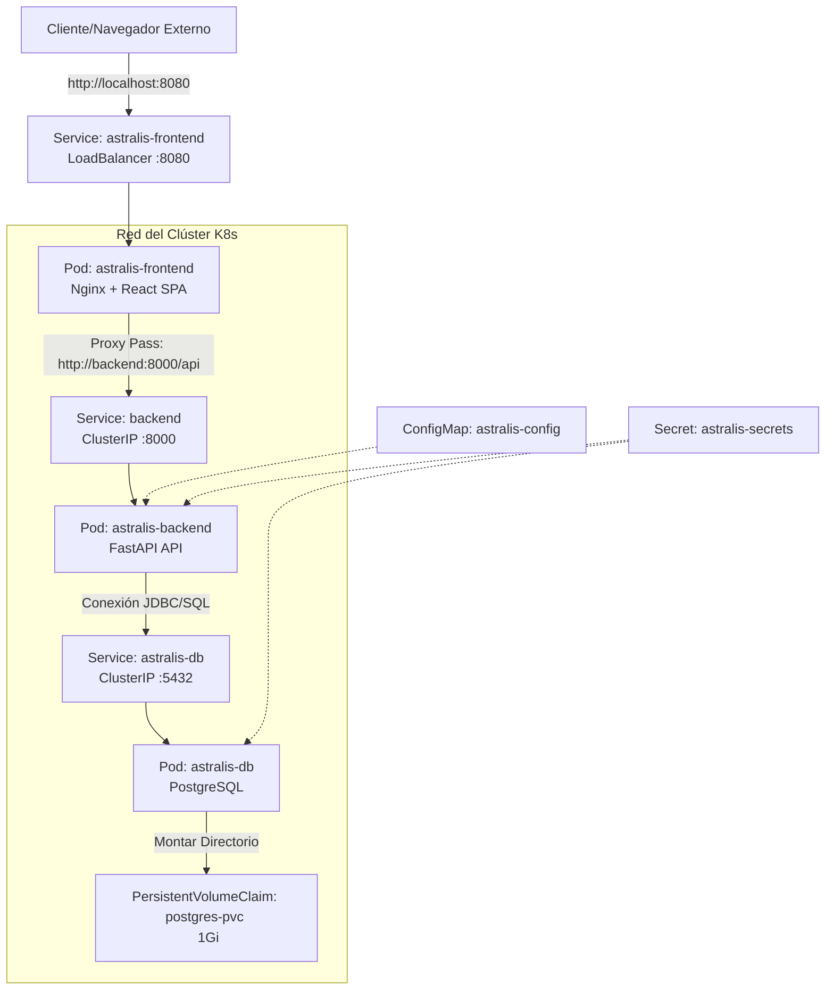

# Arquitectura y Guía de Despliegue de Kubernetes — Astralis

Este documento detalla la arquitectura de orquestación implementada para **Astralis** utilizando **Kubernetes (K8s)**. Explica el diseño de los recursos, la solución de red para la comunicación inter-servicio, y el proceso paso a paso para desplegar y verificar el sistema en clústeres locales como Docker Desktop Kubernetes o Minikube.

---

## 1. Diseño Arquitectónico

La infraestructura de Astralis se compone de tres microservicios principales desacoplados, ejecutándose en Pods aislados dentro de la red del clúster:

1. **Base de Datos (`astralis-db`):** Servidor PostgreSQL que almacena usuarios y registros locales persistidos.
2. **Backend API (`astralis-backend`):** Servicio FastAPI que expone endpoints REST, realiza cálculos astronómicos e interactúa con la BD.
3. **Frontend (`astralis-frontend`):** Servidor Nginx que aloja la SPA en React y actúa como proxy inverso para enrutar las peticiones `/api/*` al backend.

### Diagrama de Flujo y Topología



---

## 2. Descripción de los Manifiestos (`k8s/`)

Los manifiestos declarativos se organizan en la carpeta `k8s/` y constan de las siguientes especificaciones:

### A. Configuración y Seguridad
*   **`secrets.yaml`:** 
    *   Almacena credenciales críticas del sistema cifradas bajo el esquema estándar Base64 de Kubernetes.
    *   Contiene variables como `postgres-user`, `postgres-password`, `postgres-db`, `secret-key` (para tokens JWT) y la cadena completa `database-url`.
*   **`configmap.yaml`:**
    *   Define configuraciones globales no sensibles del entorno.
    *   Especifica variables de entorno como el estado del sistema (`ENV=development`) y la URL del frontend expuesta (`FRONTEND_URL=http://localhost:8080`).

### B. Capa de Datos (`db.yaml`)
*   **`PersistentVolumeClaim` (PVC):**
    *   Solicita un almacenamiento persistente de `1Gi` con acceso `ReadWriteOnce`. Esto garantiza que los datos de PostgreSQL no se borren cuando el pod de la base de datos se reinicie, se reubique o se actualice.
*   **`Deployment`:**
    *   Despliega el motor `postgres:15-alpine`.
    *   Inyecta el usuario, contraseña y base de datos inicial mapeados directamente desde `secrets.yaml`.
    *   Monta el volumen en `/var/lib/postgresql/data`.
*   **`Service`:**
    *   Expone a Postgres de manera interna a través del puerto `5432` con el nombre de host DNS `astralis-db`.

### C. Capa Lógica (`backend.yaml`)
*   **`Deployment`:**
    *   Inicializa la imagen local compilada `astralis-backend:latest`.
    *   Define variables de entorno necesarias inyectadas desde los recursos `Secret` y `ConfigMap`.
    *   Configura el puerto interno del contenedor en el `8000`.
*   **`Service`:**
    *   Crea un servicio interno de tipo `ClusterIP` expuesto en el puerto `8000`.
    *   **Importante:** Se le asignó el nombre `backend` para alinearse con la configuración de resolución DNS de Nginx.

### D. Capa de Presentación (`frontend.yaml`)
*   **`Deployment`:**
    *   Crea un Pod ejecutando la imagen `astralis-frontend:latest`.
    *   El contenedor corre un servidor web Nginx escuchando en el puerto `80` (dentro del contenedor).
*   **`Service`:**
    *   Expone el frontend hacia fuera del clúster mediante un tipo de servicio `LoadBalancer`.
    *   Mapea el puerto externo `8080` de la máquina anfitriona (localhost) hacia el puerto interno `80` del contenedor.

---

## 3. Resolución de Errores de Red Críticos: El Caso del Host Inalcanzable

Durante el despliegue inicial, el Pod del frontend entraba en bucles continuos de reinicio (estado `CrashLoopBackOff`). Los logs del pod arrojaban la siguiente falla:

```text
2026/06/12 01:47:10 [emerg] 1#1: host not found in upstream "backend" in /etc/nginx/conf.d/default.conf:10
nginx: [emerg] host not found in upstream "backend" in /etc/nginx/conf.d/default.conf:10
```

### Origen del Problema
En el archivo `nginx.conf` del frontend, se configuró un proxy inverso para pasar todas las peticiones con prefijo `/api/` al backend:
```nginx
location /api/ {
    proxy_pass http://backend:8000/api/;
    ...
}
```
En Docker Compose, esto funciona nativamente porque el servicio del backend está nombrado como `backend`. Sin embargo, en los manifiestos de Kubernetes, el servicio de red se definió originalmente como `astralis-backend`. Nginx, al arrancar, intenta validar la existencia del host `backend:8000` resolviéndolo a través del DNS interno de Kubernetes (`CoreDNS`). Al no existir, el proceso de Nginx fallaba de inmediato, impidiendo que el Pod se mantuviera arriba.

### Solución Aplicada
Se modificó el archivo `k8s/backend.yaml` para cambiar el nombre oficial del recurso del servicio a `backend`:
```yaml
apiVersion: v1
kind: Service
metadata:
  name: backend  # Modificado de astralis-backend a backend
spec:
  ports:
    - port: 8000
  selector:
    app: astralis-backend
```
Esto permite que:
1. El pod del backend conserve la etiqueta `app: astralis-backend`.
2. El clúster cree un registro DNS con la palabra `backend` enlazada a la IP interna del servicio backend.
3. El frontend de Nginx compile y arranque correctamente sin errores de resolución de nombres, posibilitando una comunicación fluida entre ambos contenedores.

---

## 4. Guía de Ejecución y Despliegue

### Paso 1: Compilar Imágenes Locales
Antes de aplicar los archivos YAML, debes compilar las imágenes de Docker del backend y el frontend con las etiquetas esperadas en tus manifiestos:
```powershell
docker build -t astralis-backend:latest ./backend
docker build -t astralis-frontend:latest ./frontend
```
*Si estás usando **Minikube**, recuerda configurar el entorno para inyectarlas directamente en su daemon de Docker ejecutando `minikube docker-env` o subiéndolas con `minikube image load astralis-backend:latest` y `minikube image load astralis-frontend:latest`.*

### Paso 2: Aplicar Manifiestos
Aplica las configuraciones en orden lógico para evitar que los Pods intenten conectarse a servicios no creados:
```powershell
# 1. Secretos y Variables
kubectl apply -f k8s/secrets.yaml
kubectl apply -f k8s/configmap.yaml

# 2. Base de Datos
kubectl apply -f k8s/db.yaml

# 3. Microservicios backend y frontend
kubectl apply -f k8s/backend.yaml
kubectl apply -f k8s/frontend.yaml
```
*(También puedes usar el script automatizado `./deploy.ps1` en la raíz del proyecto y seleccionar la opción `2`).*

### Paso 3: Verificar Pods y Servicios
Monitorea que todos los pods estén en estado `Running` con su respectivo `1/1` en la columna `READY`:
```powershell
kubectl get pods,svc
```

---

## 5. Pruebas de Conectividad (Localhost)

Dependiendo de cómo esté configurado tu Kubernetes local, la aplicación se expone de las siguientes formas:

### A. Docker Desktop (Recomendado)
Docker Desktop proporciona un balanceador de carga integrado. Automáticamente enrutará el tráfico de tu `localhost` de Windows al clúster en el puerto `8080`.
*   Abre tu navegador e ingresa a: **`http://localhost:8080`**

### B. Reenvío de Puertos (Port Forward - Fallback Universal)
Si por problemas de red el balanceador de carga de Docker Desktop no responde, puedes redirigir manualmente el tráfico desde la terminal de Windows usando:
```powershell
kubectl port-forward svc/astralis-frontend 8080:8080
```
Mantén este proceso corriendo y visita **`http://localhost:8080`**.

### C. Entorno Minikube
Si prefieres usar Minikube, abre el túnel automático para exponer el frontend con:
```powershell
minikube service astralis-frontend
```
Este comando abrirá automáticamente tu navegador web por defecto apuntando a la dirección IP interna y puerto dinámico generados por Minikube.
